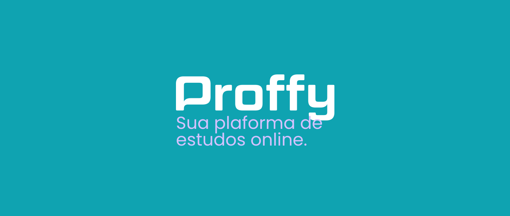

<h1 align="center"> Proffy</h1>
<h2>📌 Sobre</h2>
<p align="left">
Aplicação desenvolvida durante a NextLevelWeek#2, trata-se de uma plataforma que facilite a comunicação entre aluno e professor, uma alternativa ao modelo de estudo a distância que estamos enfrentando no momento, de uma maneira dinâmica o usuário/aluno pode procurar por profissionais qualificados na área em que deseja estudar, já os professores podem se cadastrar informando seus dados pessoais, seus horários para dar aulas e o preço/hora que almeja.
</p>
<p align="center">
      <a href="#Pré-requisitos">Instalação</a> • 
      <a href="#Funcionalidades">Funcionalidades</a> • 
      <a href="#Tecnologias">Tecnologias</a> • 
</p>
<h4 align="center">
Em desenvolvimento
</h4>

<h2>📋 Pré-requisitos</h2>
Para começar você vai precisar ter as seguintes ferramentas em sua máquina:
[Git](https://git-scm.com), [Node.js](https://nodejs.org/en/).
Também precisará de um editor para trabalhar com o código.

<h2>▶️ Rodando a API</h2>

``` bash
# Clone o repositório
$ git clone <https://github.com/Leandro2585/proffy>

# Acesse o diretório do projeto via terminal
$ cd proffy

# Vá até o diretório api
$ cd api

# Instale as dependências do projeto
$ npm install

# Execute a aplicação em modo de desenvolvimento
$ npm run dev

# O serviço ficará disponível na porta: 3333 - para acessá-la use: <localhost:3333>
```
<h2>▶️ Rodando a aplicação web</h2>
``` bash
# Clone o repositório
$ git clone <https://github.com/Leandro2585/proffy>

# Acesse o diretório do projeto via terminal
$ cd proffy

# Vá até o diretório api
$ cd web

# Instale as dependências do projeto
$ npm install

# Execute a aplicação em modo de desenvolvimento
$ npm start

# O serviço ficará disponível na porta: 3333 - para acessá-la use: <localhost:3000>
```
<h2>⚙️ Funcionalidades</h2>

<h3> Conexões</h3>

- [x] Listagem do total de conexões realizadas;
- [x] Cadastro de uma nova conexão;

</h3> Aulas</h3>
- [x] Criar aula;
- [ ] Upload de video-aula
- [x] Listagem de aulas;
    - [x] Filtrar por matéria, dia da semana e horário;
<h2>💡 Tecnologias</h2>
As ferramentas utilizadas no desenvolvimento desse projeto foram:
- [Node.js](https://nodejs.org/en/)
- [React](https://pt-br.reactjs.org/)
- [Typescript](https://typescriptlang.org/)

 <br/> Entre em contato comigo:<br/> [](https://www.linkedin.com/in/leandro-r-434b811a5/) 
| 
[](mailto:leo.real2585@gmail.com)
